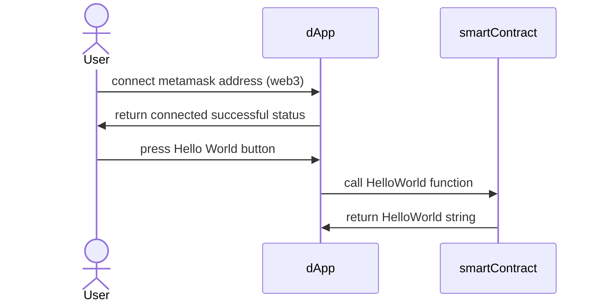
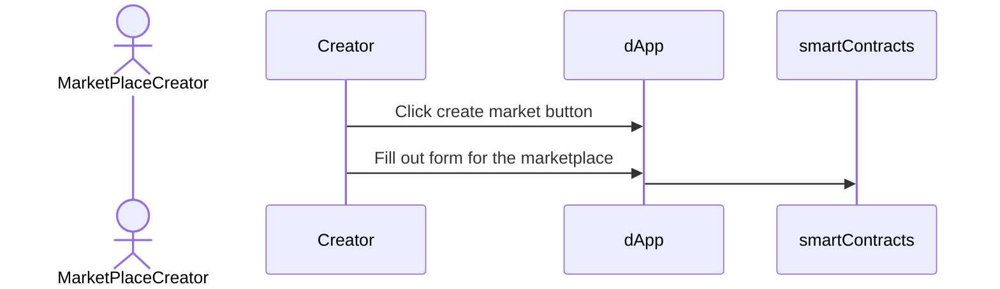
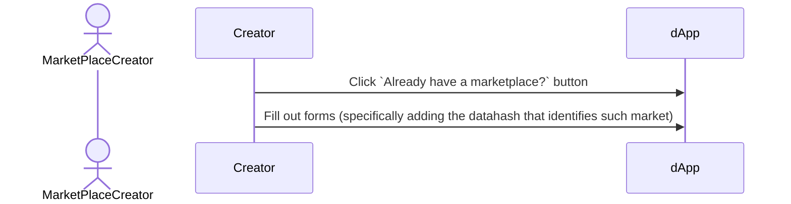

# Architecture

This file, `architecture.md`, should be the main source of truth for developers to understand the entire architecture. We must couple this `md` file with diagrams from mermaid and also datatypes used between all the entities to run a respective product.

## Diagrams

`dApp` = Teller V2 Marketplace Dapp
`contract` = Teller V2 Smart Contract

### Hello world



### Creating a marketplace



### Interfacing with your own marketplace



### Borrowing from a marketplace

```mermaid

```

### Lending to a marketplace

```mermaid

```

## Metadata schema sample for a market

```json
{
  "$version": "1.0.0", // ipfs data hash that points to the schema
  "$schema": "ipfs://ewqopfu3240rfuewfoijefljenwfj", // MUST BE IPFS HASH compliant
  "name": "test",
  "description": "this is the description for the test market",
  "properties": {
    "externalURI": "https://testmarket.io", // <== this doesn't work
    "marketFee": "10000",
    "feeRecipient": "0x034r30942390430",
    "jurisdiction": {
      "location": ["USA - DENVER"],
      "compliance": ["KYC"]
    },
    "assetClass": {
      "type": {
        "isCollateralized": true,
        "collateralTypes": "NFT"
      },
      "loanStrategyAddress": "0x021392892318431948",
      "additionalParameters": ["1000000", "3000000"] // optional, in this example both the interest and payment cycles have been added as additional parameters
    },
    "underwriters": ["cerise.eth", "dougking.eth"],
    "adhoc": {
      "name": "cerise.eth json data schema",
      "description": "my very own json data schema",
      "type": "object",
      "properties": {}
    }
  }
}
```
