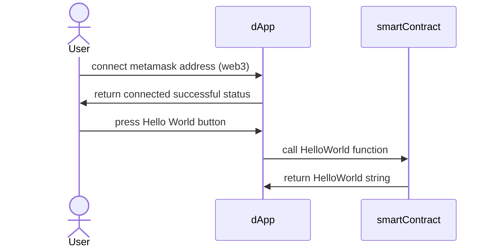

# Architecture
This file, `architecture.md`, should be the main source of truth for developers to understand the entire architecture. We must couple this `md` file with diagrams from mermaid and also datatypes used between all the entities to run a respective product.

## Example
### Mermaid Diagram
#### Hello world
